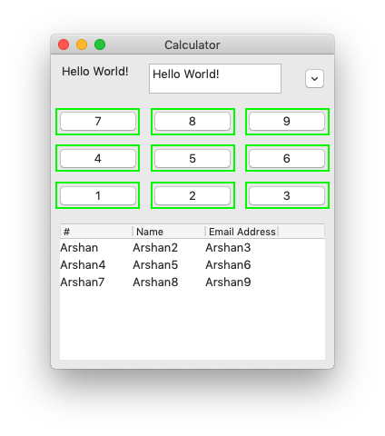

# Button



A button is an UI element which may be clickable.

Syntax:

```markup
<button>...</button>
```

Here, `...` represents text you want to appear inside the button.

Attributes:

* `onclick` Name of the event which you want to be invoked when the user clicks on the button.

