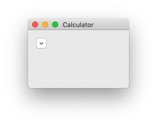
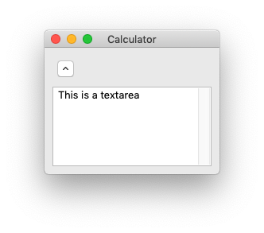

# Collapsible Pane




A UI element which holds UI elements, such as buttons, textfields, textareas, panels, etc, and can expand and collapse on click.

Syntax:

```xml
<colpane>...</colpane>
```

Here, `...` represents its content - other elements it holds. The content will expand and collapse on click.