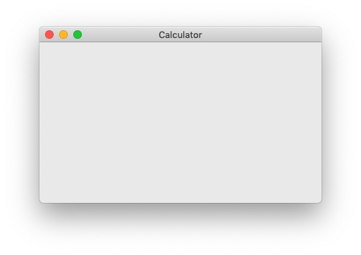

# Frame



A frame is pretty much a general window, much like the browser window you're reading this on right now.

Frames must go inside `app` tags. Here's the basic syntax:

```xml
<frame>...</frame>
```

Attributes:

- `title` Title of the frame.

Classes:

- `centered` Center the frame in the screen.
- `visible` Make the frame visible.