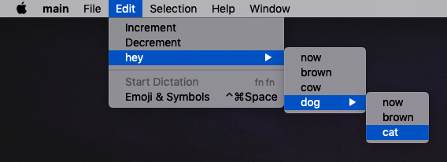

# Menu System



A menu system features a way for the user to interact with the program, through clicking items, usually presented through dropdowns.

A menu system consists primarily of:

- Menubar
- Menu
- Menu Item

A **menubar** holds **menus** - which are dropdowns, meaning that they expand and collapse on click. Each menu is going to have **menu items**, which appears when the menu is expanded.

## Syntax

A menubar:

```xml
<menu_bar>...</menu_bar>
```

The `...` includes menus.

A menubar with a menu inside:

```xml
<menu_bar>
    <menu>...</menu>
</menu_bar>
```

The `...` includes menu items.

A menubar, holding a menu, which in turn holds 3 menu items:

```xml
<menu_bar>
    <menu>
        <menu_item>...</menu_item>
        <menu_item>...</menu_item>
        <menu_item>...</menu_item>
    </menu>
</menu_bar>
```

The `...` includes text which will be shown, when the item will become visible (when its parent, the menu, will be expanded).

## Nesting

Menus can be nested inside each other by having another menu as its child.

```xml
<menu_bar>
    <menu>
        <menu>
            ...
        </menu>
    </menu>
</menu_bar>
```

Here, we got a menubar, which hosts a menu, which in turn hosts another menu.

The `...` can be menu items, or even more menus. There is no limit to the level of nesting.

## Attributes

Menu Attributes:

- `name` The name of the menu will be displayed in the menubar.