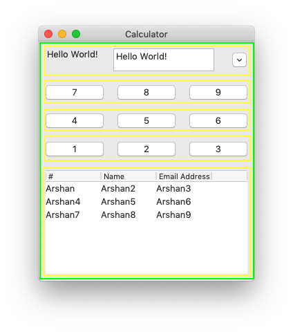

# Panel



A panel holds UI elements, such as buttons, textfields, textareas, checkboxes, etc together. It may also hold other panels.

It's highly recommended to always use panels to hold UI elements, whenever possible.

Syntax:

```markup
<panel>...</panel>
```

