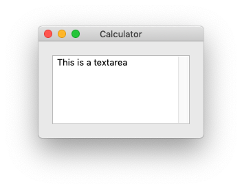

# Textarea



Similar to [Textfield](https://nahiyan.gitbook.io/ondesked/textfield) but allows multi-lined input.

Syntax:

```xml
<textarea>...</textarea>
```

Here, `...` represents text you want to appear inside the textarea.

Attributes:

- `width` How wide the textarea will be in pixel.
- `height` How tall the textarea will be in pixel.