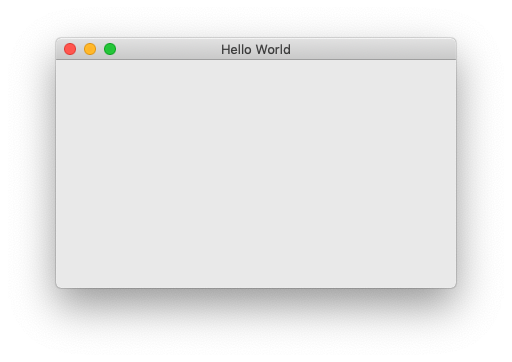
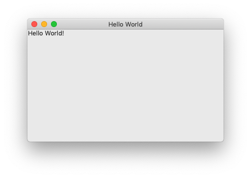

# Writing a Hello World App

## Creating a Document

The first step to creating our app is to make an Ondesked document, which will be essentially a file with `.xml` extension. Let's assume that it's called `program.xml`.

> Ondesked documents are just XML files, as Ondesked is a subset of XML.

Inside it, we'll add an `app` element to signify that it's an app:

```markup
<app>
    
</app>
```

> Ondesked document should have an app element at its root.

It is important to give the app a name. To do so, add an attribute `id` to the `app` element:

```markup
<app id="HelloWorld">
    
</app>
```

> It's conventional to use [pascal casing](http://wiki.c2.com/?PascalCase) to name your app.

## Creating a Window

Now that we got a blank app named "HelloWorld", we can create a window in it. There are several types of windows, but all we want is a typical window just like the browser window you're probably reading this guide from \(if you're on a Desktop environment\). Such a window is called `frame`. So let's create one:

```markup
<app id="HelloWorld">
    <frame>
        
    </frame>
</app>
```

We want the window, or more specifically - the frame, to be titled "Hello World." To do so, we have to add an attribute `title` to the `frame`.

```markup
<app id="HelloWorld">
    <frame title="Hello World">
        
    </frame>
</app>
```

Here's how it may look at this stage:



## Adding Text to the Window

By now, we have a blank window titled, "Hello World." Let's add the "Hello World!" text to it. To do so, we need to add a `text` element to it.

```markup
<app id="HelloWorld">
    <frame title="Hello World">
        <text>Hello World!</text>
    </frame>
</app>
```

And that's it! We should have a hello world application up and running, created with just 5 lines of code.

Here's how it may look at this stage:



## Conclusion

The app may not look perfect, nor it's the best way to add text or anything to a window. We'll discuss possible problems with it, and how to address them, in later guides.

However, this guide is intended to keep things simple for beginners. We'll look at recommended ways to do things as we progress in later guides. 